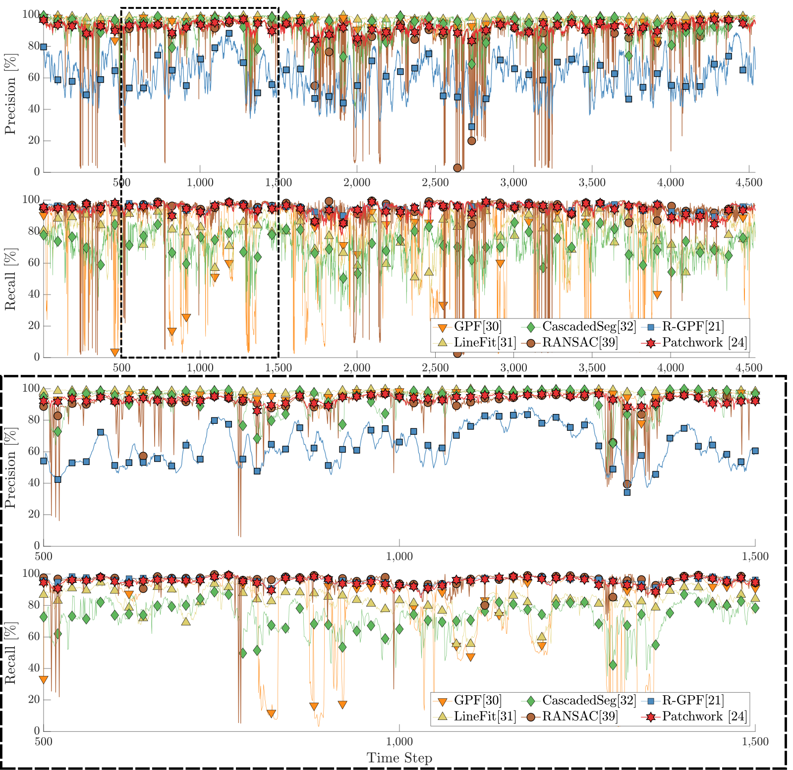
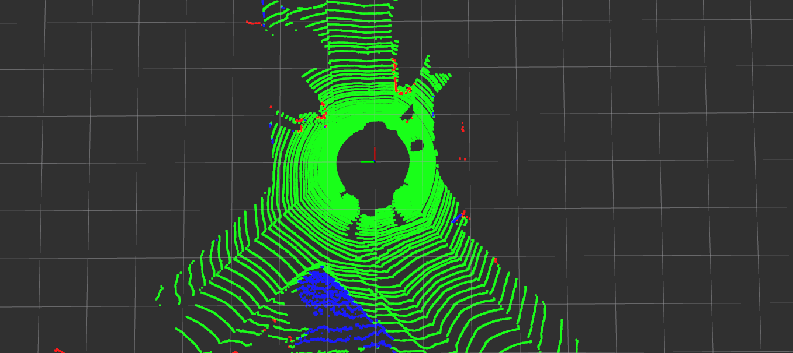

# Ground Segmentation Benchmarks 

This repository contains various Ground Segmentation baseline methods. Currently, 7 projects are organized for *SemanticKITTI dataset*:

* [GPF](https://github.com/VincentCheungM/Run_based_segmentation) (Ground Plane Fitting)
* [CascadedSeg](https://github.com/n-patiphon/cascaded_ground_seg)
* [R-GPF](https://github.com/LimHyungTae/ERASOR) (Region-wise GPF)
* [LineFit](https://github.com/lorenwel/linefit_ground_segmentation)
* [Mono plane estimation by RANSAC](https://github.com/jafrado/qhulltest)
* [Patchwork](https://github.com/LimHyungTae/patchwork) (ver.1)
* [Gaussian Floor Segmentation](https://github.com/SmallMunich/FloorSegmentation/tree/master/Gaussian_process_based_Real-time_Ground_Segmentation_for_Autonomous_Land_Vehicles)


## Contents

0. [Description](#Description)
1. [Requirements](#Requirements)
2. [Preparing DataSet](#Preparing-DataSet)
3. [Getting Started](#Getting-Started)


## Description
The benchmark provides:
### Performance Calculation
* This benchmarks calculates the performance of each method and save the results as *csv* files.
* The output files contain `frame index - time taken - Precision - Recall - TP - FP - FN - TF` values.
* Two versions are to be saved: considering vegetation / not considering vegetation.



### RVIZ
* It visualizes the ground segmentation result on RVIZ.

  * green: *True Positive*
  * blue: *False Negative*
  * red: *False Positive*


## Requirements

### Test Environment
The code wass tested successfully at
* Linux 18.04 LTS
* ROS Melodic

### Settings

* Install [ROS](http://wiki.ros.org/melodic/Installation) on a machine
* Install [jsk_visualization](https://github.com/jsk-ros-pkg/jsk_visualization) (For visualization of GLE of Patchwork)
 
```
sudo apt update
sudo apt-get install ros-melodic-jsk-recognition
sudo apt-get install ros-melodic-jsk-common-msgs
sudo apt-get install ros-melodic-jsk-rviz-plugins
```
* Install [PCL](https://pointclouds.org/downloads/)
```
sudo apt-get install libpcl-dev
```

### Install Package
* Clone our package with [catkin tools](https://catkin-tools.readthedocs.io/en/latest/)
```asm
$ cd catkin_ws/src
$ git clone https://github.com/LimHyungTae/gseg.git (can be changed)
$ catkin build gseg_benchmark
```

## Preparing Dataset

### Offline KITTI dataset
1. Download [SemanticKITTI](http://www.semantic-kitti.org/dataset.html#download) Odometry dataset including Velodyne point clouds, calibration data, and label data.
2. Set `data_path` parameter in [shellscripts/common.sh](#Set-Parameters-ofBenchmark) for your machine.

The `data_path` consists of `velodyne` folder and `labels` folder as follows:
```
data_path
    |___00
        |___labels
        |    |___000000
        |    |___000001
        |    |___ ...
        |___velodyne
            |___000000.bin
            |___000001.bin
            |___ ...
    |___01
        |___labels
        |    |___ ...
        |___velodyne
            |___ ...
```

## Getting Started

### Set Parameters of Benchmark
* Set parameters about dataset path, running method, saving csv output files in `shellscripts/common.sh`.
* Make directories to load [SemanticKITTI](#Offline-KITTI-dataset) dataset and save output files and apply them in rosparam setting.

```
rosparam set /data_path "/data/SemanticKITTI/"      # path of downloaded KITTI dataset
rosparam set /stop_for_each_frame false             # set as true to make it stop every frame 
rosparam set /init_idx 0                            # index of first frame to run
rosparam set /save_csv_file true                    # set as false if csv output files are not needed
rosparam set /output_csvpath "/data/gpf/"           # path of output files to be generated
```

###Play Sample Data

* Start roscore:
```asm
$ roscore
``` 
* Open a new terminal and launch node with specification of algorithm and data sequence:
```asm
$ cd ${path of Ground-Segmentation-Benchmark}/launch
$ roslaunch gseg_benchmark.launch alg:=${name of algorithm} seq:=${sequence}
```
* There are 7 algorithms provided: `gpf`, `cascaded_gseg`, `r_gpf`, `linefit`, `ransac`, `patchwork`, `gaussian`
* The examples of `seq` are 00, 01, ..., 10
  * If you do not set `seq` or set as `seq:=all`, then the csv output files of all datasets from "00" to "10" will be saved automatically.   
* Rviz result will be shown automatically.

---
## Contributors

* Hyungtae Lim: `shapelim@kaist.ac.kr`
* Jeewon Kim (as a research intern @[URL](https://urobot.kaist.ac.kr/)): `ddarong2000@kaist.ac.kr`

## Errors
If the following error occurs in flann
```
/usr/include/flann/util/serialization.h:35:14: error: ‘class std::unordered_map<unsigned int, std::vector<unsigned int> >’ has no member named ‘serialize’
```
then open header file
```
sudo gedit /usr/include/flann/util/serialization.h
```
and change all terms of "map" into "unordered_map".